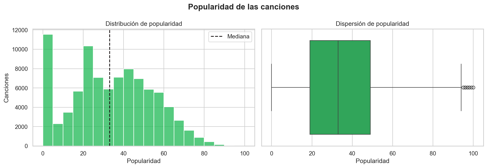
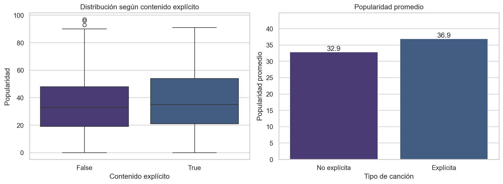
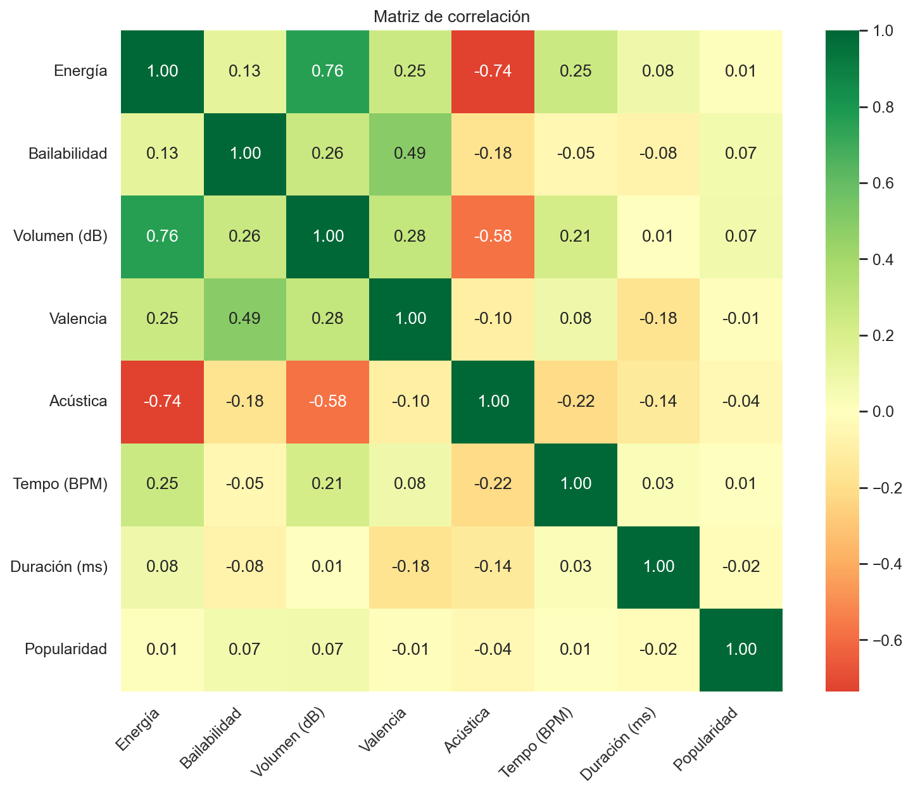

# Informe técnico - Caso C: Spotify Tracks

## Resumen ejecutivo

Este proyecto desarrolla las primeras etapas de una solución de Machine Learning para estudiar si las características musicales y el género permiten estimar la popularidad de una canción. Se trabajó con `Spotify_Dataset.zip`, correspondiente al Caso C: Inteligencia musical y predicción de popularidad de canciones.

El archivo original contiene 114.000 registros y 21 columnas. Después de eliminar el índice exportado, registros incompletos, apariciones repetidas de `track_id` y valores fuera de rangos válidos, se obtuvieron 89.495 canciones únicas y 20 columnas. El análisis exploratorio encontró una popularidad media de 33,20 y una mediana de 33. Las relaciones lineales entre popularidad y características musicales son débiles.

Los datos quedaron divididos en entrenamiento y prueba mediante un pipeline reproducible. En esta etapa no se entrenaron modelos predictivos; el modelamiento y la evaluación mediante MAE y RMSE quedan como trabajo posterior.

## 1. Descripción del problema de negocio

Artistas, sellos discográficos, equipos de marketing y curadores de listas necesitan decidir en qué canciones concentrar recursos de promoción. Debido al gran volumen de lanzamientos, tomar estas decisiones únicamente mediante intuición puede ser insuficiente.

La pregunta de negocio es:

> ¿Es posible estimar la popularidad de una canción utilizando sus características de audio y su género musical?

La variable objetivo es `popularity`, un puntaje numérico entre 0 y 100. Por esta razón, el futuro problema predictivo se plantea como una regresión. La estimación debe utilizarse como apoyo y no como garantía de éxito ni como reemplazo del criterio humano.

## 2. Objetivos del proyecto

### Objetivo general

Preparar una solución reproducible de Machine Learning que permita estimar la popularidad de una canción a partir de las variables disponibles.

### Objetivos específicos

1. Comprender la estructura y calidad del conjunto de datos.
2. Identificar valores nulos, duplicados, anomalías y valores extremos.
3. Analizar patrones entre características musicales y popularidad.
4. Identificar y documentar variables relevantes.
5. Preparar entrenamiento y prueba sin fuga de información.
6. Evaluar sesgos, privacidad, limitaciones y riesgos de uso.

## 3. KPIs asociados al problema

| KPI | Meta | Estado de esta entrega |
|---|---:|---|
| Retención de registros sobre las filas originales | Documentar el efecto de la limpieza | 78,50%: 89.495 de 114.000 filas |
| Retención posterior a la deduplicación | Al menos 95% de registros válidos | 99,73% de los IDs únicos |
| Reproducibilidad | 100% de notebooks organizados | Cuatro notebooks por etapa |
| Variables relevantes documentadas | Al menos 5 | Siete variables numéricas y variables de grupo |
| MAE del futuro modelo | 15 puntos o menos | Pendiente de modelamiento |
| Mejora frente al modelo base | Al menos 10% | Pendiente de modelamiento |

El MAE representa el error absoluto promedio entre la popularidad real y la predicha. La meta `MAE <= 15` significa que el futuro modelo debería equivocarse, en promedio, en un máximo de 15 puntos de popularidad.

## 4. Descripción de las fuentes de datos

- Dataset utilizado: `Spotify_Dataset.zip`.
- Caso académico: Caso C - Spotify Tracks.
- Archivo analizado: `Spotify_Tracks_Dataset.csv`.
- Archivo dentro del proyecto: `data/raw/Spotify_Tracks_Dataset.csv`.
- Tamaño original: 114.000 filas y 21 columnas.
- Unidad de análisis: registro de una canción asociado a un género musical.
- Variable objetivo: `popularity`, entre 0 y 100.

Las variables disponibles incluyen identificadores, artista, álbum, canción, género, duración, contenido explícito y características de audio como bailabilidad, energía, volumen, acústica, valencia y tempo.

El ZIP no contiene una fecha de extracción ni información de licencia verificable. Por ello, el uso se limita al contexto académico y no se atribuye una fuente externa no confirmada.

## 5. Preparación de los datos

### Diagnóstico inicial

- 114.000 filas y 21 columnas.
- Tres valores nulos concentrados en un registro.
- 24.259 apariciones repetidas de `track_id`.
- 89.741 identificadores únicos antes de aplicar las reglas de calidad.
- Una columna sin valor analítico: `Unnamed: 0`.

### Limpieza aplicada

1. Se eliminó `Unnamed: 0` mediante `drop()`.
2. Se eliminaron registros sin artista, álbum o canción mediante `dropna()`.
3. Se conservó una aparición por `track_id` mediante `drop_duplicates()`.
4. Se aceptaron duraciones entre 30 segundos y 20 minutos.
5. Se eliminaron tempos no positivos y compases fuera del rango de 1 a 5.
6. Se validaron características normalizadas entre 0 y 1.
7. Se verificó que la popularidad estuviera entre 0 y 100.

El resultado se guarda en `data/processed/spotify_tracks_clean.csv` y contiene 89.495 canciones, 20 columnas, cero valores nulos y cero `track_id` repetidos.

## 6. Análisis exploratorio de datos (EDA)

### Distribución de popularidad

- Media: 33,20.
- Mediana: 33.
- Desviación estándar: 20,59.
- Rango: 0 a 100.
- El 50% central se encuentra entre 19 y 49.
- Solo el 3,49% presenta popularidad igual o superior a 70.



### Contenido explícito

Las canciones explícitas presentan una popularidad promedio de 36,89 y las no explícitas de 32,86. La diferencia es descriptiva y puede estar influida por género, artista, público o promoción; no demuestra causalidad.



### Relaciones con popularidad

| Variable | Correlación con `popularity` | Interpretación |
|---|---:|---|
| `loudness` | 0,0725 | Positiva muy débil |
| `danceability` | 0,0655 | Positiva muy débil |
| `acousticness` | -0,0388 | Negativa muy débil |
| `duration_ms` | -0,0210 | Negativa muy débil |
| `energy` | 0,0140 | Casi nula |
| `valence` | -0,0116 | Casi nula |
| `tempo` | 0,0087 | Casi nula |

Ninguna característica musical individual explica por sí sola la popularidad. El fenómeno es multifactorial y también depende de elementos comerciales, culturales y temporales que no aparecen en el dataset.



### Valores extremos

La regla del rango intercuartílico detectó 4.926 valores extremos en volumen, 4.159 en duración, 368 en tempo, 346 en bailabilidad y 11 en popularidad. Se conservaron cuando cumplían los rangos válidos, porque podrían representar canciones reales y no errores.

## 7. Preparación para modelamiento

La variable objetivo `popularity` se separó de las predictoras. Se excluyeron `track_id`, artista, álbum y nombre de canción para reducir la memorización y la fuga indirecta de información.

- Variables continuas: se transforman con `StandardScaler`.
- Variables categóricas: se codifican con `OneHotEncoder`.
- Variable `explicit`: se convierte a 0 y 1.
- Entrenamiento: 71.596 registros, equivalentes al 80%.
- Prueba: 17.899 registros, equivalentes al 20%.
- Semilla: 42.
- Variables resultantes después de transformar: 142.

La estratificación utiliza grupos de popularidad para mantener proporciones semejantes de canciones con popularidad baja, media y alta en entrenamiento y prueba. El pipeline aprende sus parámetros únicamente con entrenamiento y luego transforma prueba, evitando fuga de información.

## 8. Metodología utilizada: CRISP-DM

### 8.1 Comprensión del negocio

Se definieron el problema, los usuarios potenciales, los objetivos y los KPIs. Se estableció que popularidad es una señal comercial y no una medición de calidad musical.

### 8.2 Comprensión de los datos

Se revisaron dimensiones, tipos, valores nulos, duplicados, estadísticas, distribuciones, relaciones y valores extremos.

### 8.3 Preparación de los datos

Se aplicaron las reglas de limpieza, se seleccionaron predictores, se separó la variable objetivo y se creó un pipeline reproducible.

### 8.4 Modelamiento

Pendiente. Se propone comparar un modelo base que prediga la media, una regresión lineal y un modelo no lineal como Random Forest.

### 8.5 Evaluación

Pendiente. Deberá comparar MAE y RMSE, además de revisar errores por género y nivel de representación del artista.

### 8.6 Despliegue

Fuera del alcance actual. Un uso real requeriría monitoreo, actualización de datos, control de acceso y revisión humana.

## 9. Ética, sesgos y privacidad

- El 64,12% de los artistas aparece con una sola canción.
- El 1% de los artistas más representados concentra el 17,27% de las canciones.
- Los géneros contienen entre 73 y 1.000 registros.
- Solo el 3,49% de las canciones alcanza una popularidad igual o superior a 70.

Estos desequilibrios pueden favorecer canciones comerciales o artistas conocidos y perjudicar a artistas emergentes. Los nombres e identificadores también permiten vincular registros con otras fuentes. Se recomienda evaluar errores por grupo, minimizar identificadores, mantener revisión humana y no automatizar decisiones de exclusión o financiamiento.

## 10. Conclusiones

1. La limpieza produjo un conjunto consistente de 89.495 canciones únicas.
2. La popularidad es multifactorial y no se explica con una sola característica musical.
3. El género y el contenido explícito muestran diferencias descriptivas, no causales.
4. El pipeline deja los datos preparados de forma reproducible y sin fuga de información.
5. Todavía no se entrenó ni evaluó un modelo predictivo.
6. Una futura predicción debe apoyar el criterio humano y no convertirse en una decisión automática.

## 11. Limitaciones

- La popularidad cambia con el tiempo y no existe fecha de medición en la copia.
- Faltan variables de promoción, seguidores, playlists, país y antigüedad.
- La representación de artistas y géneros es desigual.
- Al deduplicar se conserva un solo género por canción.
- No se entrenaron modelos predictivos en esta etapa.
- Las asociaciones observadas no demuestran causalidad.

## 12. Reproducción del proyecto

Desde la raíz del repositorio:

```bash
python -m venv .venv
.venv\Scripts\activate
pip install -r requirements.txt
python src/data/clean_data.py
python src/analysis/eda_complete.py
python src/features/prepare_features.py
```

Los notebooks deben ejecutarse en este orden:

1. `notebooks/01_eda_inicial.ipynb`.
2. `notebooks/02_limpieza_datos.ipynb`.
3. `notebooks/03_eda_completo.ipynb`.
4. `notebooks/04_preparacion_datos.ipynb`.

Los resultados esperados son el dataset limpio, los archivos de entrenamiento y prueba, el pipeline de preparación y los gráficos del EDA.

## 13. Archivos principales

| Ruta | Propósito |
|---|---|
| `README.md` | Presentación general del repositorio |
| `INFORME_TECNICO.md` | Informe técnico solicitado por la pauta |
| `src/data/clean_data.py` | Limpieza reproducible |
| `src/analysis/eda_complete.py` | EDA y generación de gráficos |
| `src/features/prepare_features.py` | Separación y pipeline |
| `data/processed/` | Datos limpios, entrenamiento y prueba |
| `images/eda/` | Visualizaciones del análisis |
| `docs/etica_privacidad.md` | Evaluación ética detallada |
